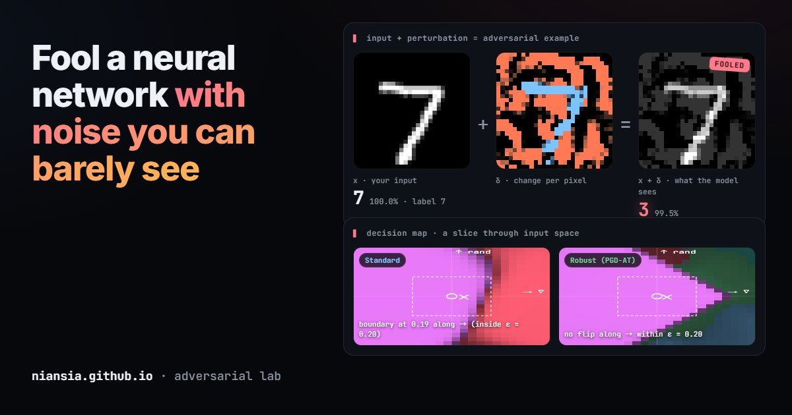

# Adversarial Lab 對抗樣本實驗室

[English](README.md) · **繁體中文**

**用幾乎看不見的雜訊騙過神經網路，再看一個經過對抗訓練的模型如何守住。**

Adversarial Lab 是一個在瀏覽器裡執行的 L∞ 對抗攻擊實驗場，對象是手寫數字分類器。你可以自己畫一個數字，或從 MNIST 測試集挑一個，用 FGSM、PGD 或指定目標的 PGD 攻擊它，一步一步看預測怎麼被翻轉。接著對一個用 PGD 對抗訓練過的模型做同樣的攻擊，再用決策地圖說明為什麼一個會被攻破、另一個不會。所有運算（包含攻擊所需的梯度）都在訪客自己的 CPU 上完成，不會上傳任何資料。

**線上試玩：[niansia.com/lab/adversarial](https://niansia.com/lab/adversarial/zh-tw/)**（英文、繁體中文、簡體中文）



*ε = 0.2 的 PGD 攻擊讓一般模型把這個 7 認成 3（99.5%），經過對抗訓練的模型看同一張圖仍然判斷是 7（99.9%）。下方是以這個數字為中心的輸入空間 2D 切面（→ 梯度符號方向，↑ 隨機方向，虛線方框是 ε 範圍）。一般模型沿梯度方向的決策邊界落在 ε 範圍內，穩健模型的邊界則在範圍之外。*

## 結果

兩個小型 CNN（各約 20.7 萬參數），用 MNIST 訓練集在 CPU 上訓練。攻擊下的準確率以 MNIST 測試集前 2,000 張量測，乾淨準確率以全部 10,000 張量測。

| 模型 | 乾淨 | PGD ε = 0.1 | ε = 0.2 | ε = 0.3 | ε = 0.35 | ε = 0.4 |
|---|---:|---:|---:|---:|---:|---:|
| 一般模型 | 98.95% | 53.3% | 0.2% | 0.0% | 0.0% | 0.0% |
| 穩健模型（PGD-AT，ε = 0.3） | 97.92% | 95.1% | 92.2% | **85.3%** | 13.2% | 0.0% |
| 轉移：用一般模型產生的樣本攻擊穩健模型 | | 96.4% | 95.0% | 92.8% | 62.4% | 10.5% |

完整的 ε 網格、FGSM 結果與所有設定請見 [`web/robustness.json`](web/robustness.json) 與[英文版 README](README.md#results)。

- **評估方式**：像素空間 [0, 1] 下的 L∞ 威脅模型。PGD-40 每步 2.5·ε/40、一次隨機起點；FGSM 是步長 ε 的單步攻擊。
- **穩健性的代價**：乾淨準確率少約一個百分點（98.95% → 97.92%），每個 epoch 的運算約為 8 倍（這裡 epoch 數也多一倍，總計約 16 倍）。
- **穩健性只到訓練時的強度為止**：穩健模型在它訓練用的 ε = 0.3 還有 85%，超過之後就崩掉（ε = 0.35 只剩 13%）。
- **檢查梯度遮蔽**（Athalye 等人，2018）：在每個 ε 下，多步白箱攻擊都比單步攻擊強（PGD ≤ FGSM），也比轉移攻擊強，而且 ε 夠大時準確率會降到 0%。這些檢查都無法排除更強的攻擊，所以**穩健準確率是上限**，不是保證；本專案沒有跑 AutoAttack。

## 試玩頁可以看到什麼

- **x + δ = x′**：輸入、擾動 δ（藍色是變暗、琥珀色是變亮，以 ε 為刻度）與對抗樣本，加上預測結果和「被騙了／守住了」的判定。
- **攻擊**：FGSM、PGD（1–100 步）與指定目標的 PGD（「讓它被認成 3」），ε 可在 0 到 0.4 之間調整，支援逐步播放，並顯示各類別機率、信心軌跡，以及在第幾步翻轉。
- **梯度檢視**：損失對每個像素的梯度。一般模型的梯度像雜訊，穩健模型的梯度則沿著數字的筆畫。
- **轉移**：每張對抗樣本也會拿給另一個模型看。
- **決策地圖**：以輸入為中心的輸入空間切面 x + a·u + b·v，u 是損失梯度的符號（FGSM 的方向），v 是隨機的 ±1 方向，每一格依預測類別與信心上色。對抗方向很特別：一般模型沿 u 走一小步就改變答案，沿 v 卻幾乎不變。
- **穩健性曲線**：上面的離線評估結果，並標出目前的 ε。

## 運作方式

**模型**（`advlab/common.py`）：5×5 卷積（16）→ ReLU → max-pool → 3×3 卷積（32）→ ReLU → max-pool → 全連接 128 → 全連接 10，直接吃 [0, 1] 的原始像素（不做標準化，所以 ε 就是「每個像素最多改多少」）。

**訓練**（`advlab/train.py`）：Adam 加 one-cycle 學習率（最大 2·10⁻³），batch 128。一般模型訓練 3 個 epoch。穩健模型使用 PGD 對抗訓練（Madry 等人，2018）訓練 6 個 epoch：每一批資料先用 ε = 0.3、7 步（步長 0.1）的 PGD 攻擊，再拿攻擊後的資料訓練；第一個 epoch 內 ε 由 0 線性增加。兩個模型加上上面的評估，用 4 個 CPU 執行緒共花 15 分鐘。

**在瀏覽器裡**（`web/advnet.js`）：前向傳播*和*損失對輸入的梯度都用純 JavaScript 實作（im2col 卷積、max-pool 索引回傳），因此 FGSM 與 PGD 的行為和 PyTorch 一致。`advlab/gradcheck.py` 會把 logits 與輸入梯度和 PyTorch 比對（最大誤差約 10⁻⁸）。權重以 float16 發佈（每個模型 405 KB）。一次 PGD-40 攻擊約 0.3 秒；兩張決策地圖（24 × 24，由粗到細）在兩個 Web Worker 中約 5 秒完成，隨時可以取消。

## 自己執行

```bash
pip install -r requirements.txt
```

在本機提供網頁（任何靜態伺服器都可以；頁面的 Worker 需要透過 HTTP 載入）：

```bash
python -m http.server 8000
```

然後打開 <http://localhost:8000/web/?lang=zh-TW>。

重新訓練與評估。腳本會從 `MNIST_DIR`（預設 `D:\data\mnist`）讀取 MNIST 官方的四個 `*-ubyte.gz` 檔：

```bash
python advlab/train.py --threads 4
```

訓練完全不使用 GPU（會隱藏 CUDA），只用少量執行緒並以最低優先度執行，可以和其他工作共用電腦。它會覆寫 `web/standard.bin`、`web/robust.bin` 與 `web/robustness.json`。

檢查 JavaScript 引擎與 PyTorch 是否一致：

```bash
python advlab/gradcheck.py
```

`advlab/export_samples.py` 產生範例數字（`web/samples.json`），`advlab/og_shot.py` 用 Playwright 從執行中的頁面產生 `docs/preview.jpg`。

## 限制

- MNIST 是對抗穩健性最容易的場景，同樣的方法在自然影像上的保證會弱很多。
- 模型很小，也只在 CPU 上短暫訓練；這些數字描述的是這兩個模型，不代表目前最好的方法。
- 一次隨機起點的 PGD 是強攻擊，但不是窮舉；穩健準確率是上限。
- 手繪數字會照 MNIST 的方式置中與縮放，但很特別的筆跡在攻擊前就可能被認錯。

## 參考文獻與授權

參考文獻見[英文版 README](README.md#references)。程式碼採用 [MIT License](LICENSE)；`web/samples.json` 含 30 張 MNIST 測試集數字，MNIST 以 CC BY-SA 3.0 授權。
